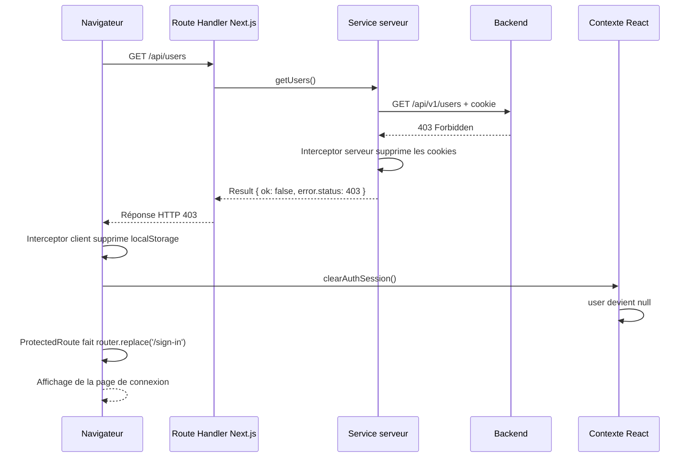
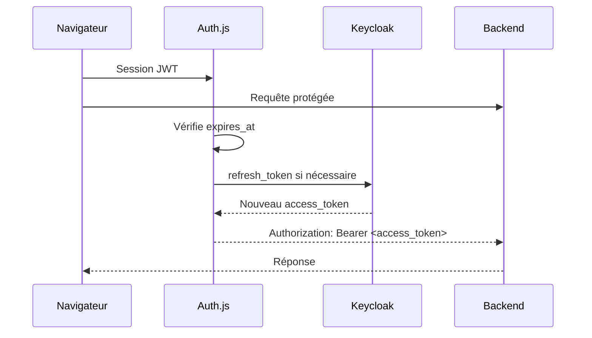

# TailAdmin Dashboard

Application Next.js avec authentification par cookie de session, API proxy et protection des routes privées.

## Démarrage

Installer les dépendances puis démarrer le serveur de développement :

```bash
npm install
npm run dev
```

L’application est disponible sur [http://localhost:3000](http://localhost:3000).

## Gestion de l’expiration de session

### Le problème initial

L’utilisateur est conservé à deux endroits différents :

- dans le cookie de session, utilisé par le backend ;
- dans le contexte React et `localStorage`, utilisés par le frontend pour savoir si l’utilisateur est connecté.

Ces deux informations peuvent être désynchronisées. Par exemple, le cookie peut expirer côté backend alors que le frontend possède encore l’utilisateur dans `localStorage`.

Dans ce cas, le backend renvoie `401 Unauthorized` ou `403 Forbidden`.

Avant la correction, le flux était le suivant :

1. Le service serveur appelait l’API backend.
2. L’API backend renvoyait `403`.
3. Le service transformait l’erreur en objet `Result` :

   ```ts
   { ok: false, error: { status: 403, ... } }
   ```

4. Le Route Handler Next.js renvoyait malgré tout HTTP `200`.
5. Axios côté navigateur pensait que la requête avait réussi.
6. Le contexte React contenait toujours `user`.
7. `ProtectedRoute` ne redirigeait donc pas l’utilisateur.

Le problème principal était que le statut HTTP `403` était masqué derrière une réponse HTTP `200`.

### Les fichiers concernés

| Fichier                                       | Responsabilité                                                              |
| --------------------------------------------- | --------------------------------------------------------------------------- |
| `src/lib/auth/components/auth.context.tsx`    | Stocke l’utilisateur dans le contexte React et synchronise `localStorage`.  |
| `src/lib/auth/auth-session.ts`                | Centralise le stockage et le nettoyage de la session frontend.              |
| `src/config/axios/frontend-http.config.ts`    | Interceptor Axios exécuté dans le navigateur.                               |
| `src/config/axios.config.ts`                  | Client Axios utilisé côté serveur.                                          |
| `src/config/interceptors/auth.interceptor.ts` | Gestion des cookies et suppression des cookies expirés côté serveur.        |
| `src/lib/shared/api-response.ts`              | Transforme un `Result` en réponse HTTP en préservant les statuts `401/403`. |
| `src/lib/auth/components/protected-route.tsx` | Protège les pages et redirige vers `/sign-in`.                              |

## Fonctionnement côté serveur

Les services serveur utilisent `apiClient(true)`, par exemple :

```ts
const response = await apiClient(true).get(usersUrl);
```

`apiClient(true)` utilise `httpClient()` dans `src/config/axios.config.ts`. Ce client installe un interceptor de réponse qui appelle `expiredSessionInterceptor` lorsqu’une requête backend échoue.

Dans `src/config/interceptors/auth.interceptor.ts` :

1. Le statut de l’erreur est lu.
2. Si le statut vaut `401` ou `403`, les cookies de session sont supprimés.
3. L’erreur est ensuite rejetée avec `Promise.reject(error)` afin de poursuivre le traitement normal de l’erreur.

Cela permet de supprimer la session côté serveur, mais le serveur ne peut pas modifier directement le state React du navigateur.

## Conservation du statut HTTP

Les services serveur retournent volontairement un type `Result` pour distinguer une réussite d’une erreur :

```ts
type Result<T, E> = { ok: true; data: T } | { ok: false; error: E };
```

Le helper `resultResponse()` dans `src/lib/shared/api-response.ts` convertit ce résultat en `NextResponse` :

- les erreurs habituelles continuent à être renvoyées en `200`, car elles font partie du format métier de l’application ;
- les erreurs `401` et `403` conservent leur statut HTTP réel.

Exemple :

```ts
const response = await getUsers(filters);
return resultResponse(response);
```

Grâce à cela, `/api/users` renvoie réellement `403` lorsque le backend refuse la session. Le navigateur peut donc détecter l’expiration.

Les routes publiques de connexion et d’inscription restent traitées séparément afin qu’un mauvais identifiant ou une erreur de formulaire ne provoque pas une déconnexion inutile.

## Fonctionnement côté client

Les services client utilisent `frontendHttp()`. Son interceptor de réponse écoute les statuts `401` et `403`.

Lorsqu’un de ces statuts arrive depuis une route API protégée :

1. `clearAuthSession()` supprime `auth_user` du `localStorage`.
2. Le système de listeners notifie `AuthUserProvider`.
3. Le provider exécute `setUserState(null)`.
4. Tous les composants qui utilisent `useSession()` reçoivent `user = null`.

Le provider expose aussi `signOut()`, qui utilise le même mécanisme. La déconnexion manuelle et la déconnexion automatique utilisent donc une seule logique de nettoyage.

## Rôle de `ProtectedRoute`

`ProtectedRoute` ne vérifie pas lui-même le cookie backend. Il observe l’état du contexte React :

```ts
const { user, isLoading } = useSession();
```

Quand la session est nettoyée et que `user` devient `null`, cette condition est exécutée :

```ts
if (!guestOnly && !user) {
  router.replace(redirectTo);
}
```

La valeur par défaut de `redirectTo` est `/sign-in`. Le composant :

- affiche la page si l’utilisateur est connecté ;
- masque la page pendant le chargement initial ;
- redirige vers `/sign-in` si l’utilisateur n’est plus connecté ;
- redirige les utilisateurs non administrateurs lorsqu’une page utilise `adminOnly`.

## Flux complet en cas de `403`



## Pourquoi gérer les deux côtés ?

Les deux interceptors ont des responsabilités différentes.

### Interceptor serveur

- lit et transmet les cookies au backend ;
- détecte les sessions invalides lors des appels backend ;
- supprime les cookies côté serveur ;
- permet au Route Handler de transmettre le statut `401/403`.

### Interceptor client

- reçoit le statut `401/403` de la route API Next.js ;
- supprime la session stockée dans le navigateur ;
- notifie le contexte React ;
- permet à `ProtectedRoute` de rediriger l’utilisateur.

Un seul des deux côtés ne suffit pas : le serveur ne peut pas modifier le contexte React, et le navigateur ne peut pas supprimer directement un cookie `httpOnly`.

## Vérification du comportement

Pour tester le flux :

1. Se connecter normalement.
2. Ouvrir une page protégée, par exemple le dashboard.
3. Expirer ou invalider la session côté backend.
4. Déclencher une requête, par exemple le chargement des utilisateurs.
5. Vérifier dans les logs que le backend renvoie `403`.
6. Vérifier que le navigateur reçoit également `403` pour `/api/users`.
7. Vérifier que l’utilisateur est renvoyé vers `/sign-in`.

Les validations TypeScript et ESLint peuvent être lancées avec :

```bash
npm run check-types
npm run lint
```

## Authentification Keycloak avec Auth.js

L’application peut utiliser Keycloak comme second provider sans modifier le flux
legacy. Le provider est sélectionné par `AUTH_PROVIDER` côté serveur et par
`NEXT_PUBLIC_AUTH_PROVIDER` côté client :

```dotenv
AUTH_PROVIDER=keycloak
NEXT_PUBLIC_AUTH_PROVIDER=keycloak
AUTH_KEYCLOAK_ID=<client_id>
AUTH_KEYCLOAK_SECRET=<client_secret>
AUTH_KEYCLOAK_ISSUER=https://<host>/realms/<realm>
AUTH_SECRET=<secret_aleatoire>
```

Pour conserver l’authentification Spring Boot existante, utiliser
`AUTH_PROVIDER=legacy` et `NEXT_PUBLIC_AUTH_PROVIDER=legacy`.

### Fonctionnement Keycloak

- `auth.ts` configure Auth.js v5 avec le provider Keycloak et une session JWT.
- La page `/sign-in` affiche un bouton de redirection OAuth en mode Keycloak,
  ou le formulaire email/mot de passe existant en mode legacy.
- Le callback JWT conserve `access_token`, `refresh_token`, `expires_at` et
  convertit `realm_access.roles` vers `UserRole.ADMIN` ou `UserRole.USER`.
- Lorsque le token arrive à expiration, le callback renouvelle automatiquement
  l’access token via le endpoint OpenID Connect de Keycloak.
- Les appels serveur à `apiClient(true)` utilisent l’interceptor Bearer en mode
  Keycloak et continuent à transmettre les cookies en mode legacy.
- `AuthUserProvider` adapte la session Auth.js à la même interface
  `SessionContextType` que le stockage `localStorage` historique.

Le handler Auth.js est disponible sous `/api/auth/[...nextauth]`. Le composant
`ProtectedRoute` reste inchangé : il dépend uniquement de `useSession()` et
fonctionne donc dans les deux modes.

### Flux de renouvellement



## Ressources

- [Documentation Next.js](https://nextjs.org/docs)
- [Documentation Axios](https://axios-http.com/docs/interceptors)
- [Documentation React Context](https://react.dev/reference/react/createContext)
